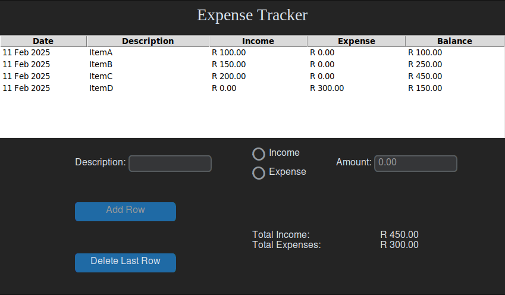

# Expense Tracker

The Expense Tracker is in South African Rands \(R\).



## Installation

Python is obviously required, since this is a python application. It is highly recommended to use a Python Virtual Environment: `pip install virtualenv`

### Create Python Virtual Environment:
After cloning the repository, first go into the project folder to create the virtual environment.

Windows:
```cmd
python -m venv .venv
.venv\Scripts\activate
```

Linux:
```bash
python -m venv .venv
source .venv/bin/activate
```

### Install Dependencies:
```bash
pip install -r requirements.txt
```

Then run the 'main\.py' file: `python main.py`
